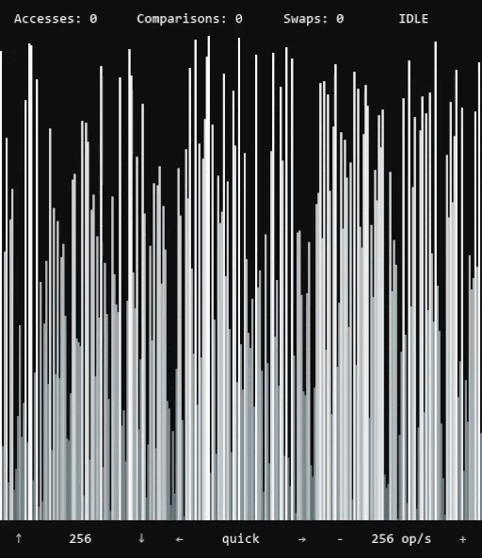

# engine de visualização de algoritmos de ordenação


visualização interativa de algoritmos de ordenação em python utilizando pygame, com métricas de execução em tempo real.

## demonstração



## sobre o projeto

projeto desenvolvido para visualizar a execução de diferentes algoritmos de ordenação em tempo real, destacando operações fundamentais como comparações, trocas e acessos ao array.

o projeto é organizado nos seguintes componentes:

- **Visualizer** — gerencia o estado da aplicação, eventos e execução dos algoritmos
- **SortingArray** — estrutura que armazena os valores e contabiliza as operações
- **algorithms.py** — implementações dos algoritmos de ordenação
- **AlgorithmRender** — renderização visual das barras do array
- **UIRender** — interface e exibição das estatísticas

os algoritmos operam sobre a estrutura `SortingArray`, que registra os acessos, comparações e trocas entre elementos. essas operações são utilizadas pelo `Visualizer` para atualizar as estatísticas a visualização em tempo real através do `AlgorithmRender` e `UIRender`.

### características principais

- diferencia visualmente operações de troca, comparação e pivoteamento
- contagem de acessos, comparações e trocas atualizada em tempo real
- controle de estado, tamanho, velocidade e algoritmo selecionado
- interface simples e direta construída com pygame

### algoritmos implementados

- bubble sort
- insertion sort
- quick sort
- selection sort

## possíveis melhorias

- adicionar sons para as operações
- mostrar quando o array está ordenado através de barras verdes
- adicionar novos algoritmos (merge sort, heap sort, etc.)

## requisitos

- **Python 3.12** (recomendado para melhor compatibilidade com pygame)

## instalação e execução

```bash
git clone https://github.com/olucaxx/sorting-visualization
cd sorting-visualization
python -m venv .venv 
source .venv/Scripts/activate
pip install -r requirements.txt
python src/visualizer.py
```

## controles

| ação | tecla |
|-----|------|
| embaralhar array | espaço |
| rodar / pausar algoritmo | enter |
| algoritmo anterior | ← |
| próximo algoritmo | → |
| aumentar velocidade | + |
| reduzir velocidade | - |
| aumentar tamanho do array | ↑ |
| reduzir tamanho do array | ↓ |